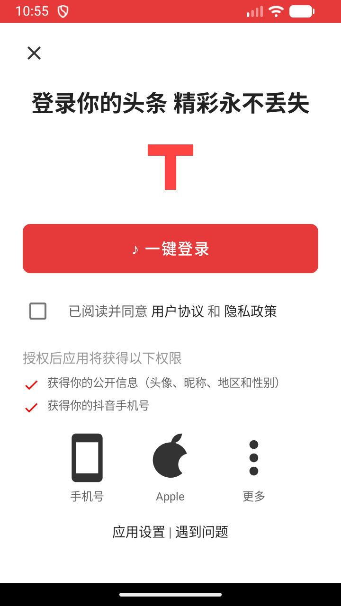
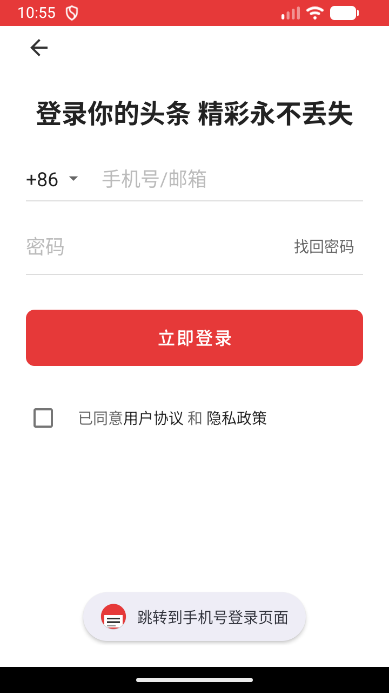
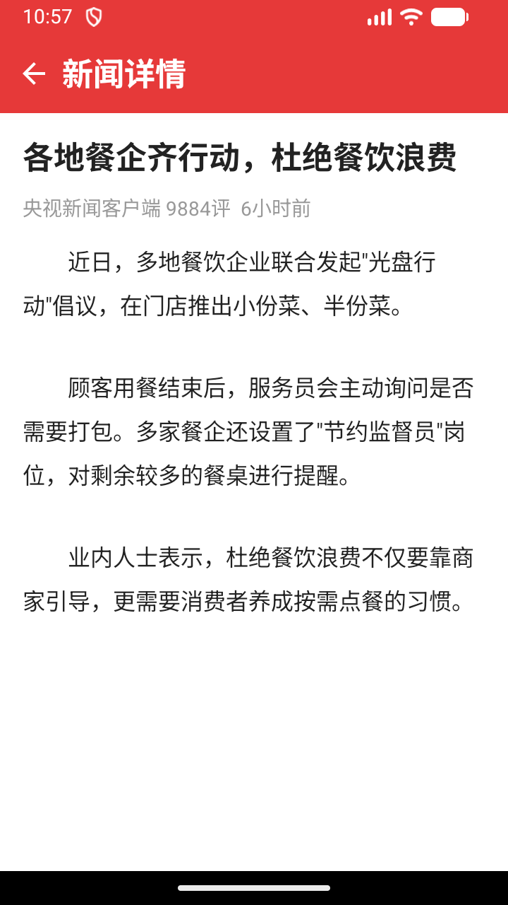
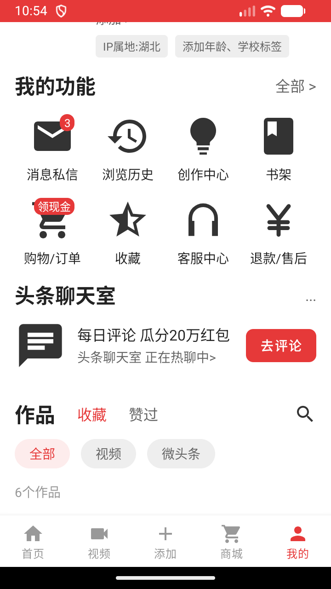
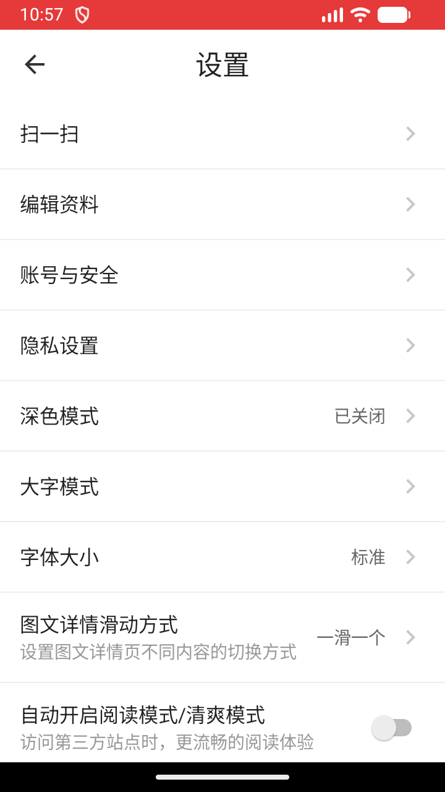
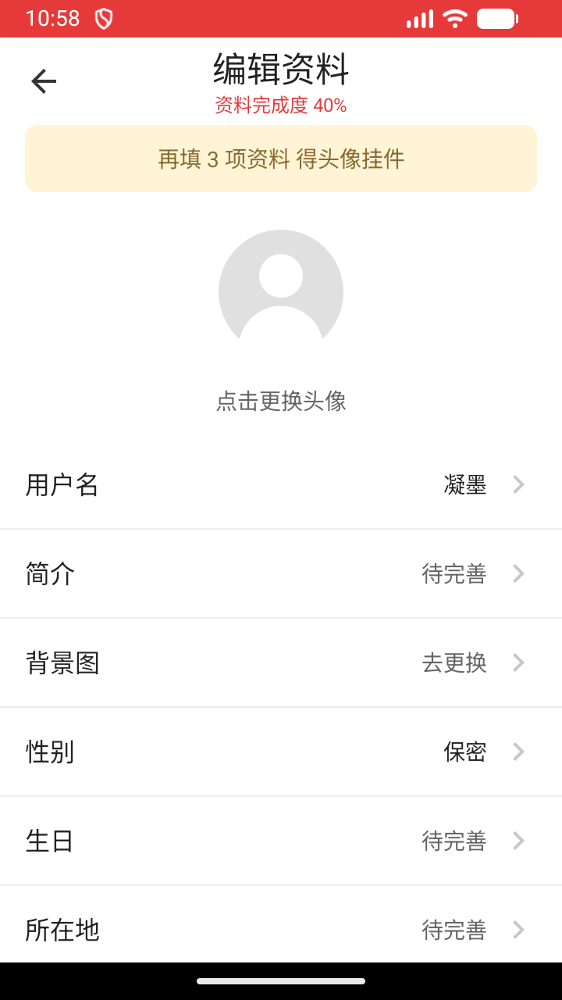

# 仿今日头条 · Android 课程设计

一个纯 Java + XML 布局实现的今日头条客户端复刻，覆盖登录、信息流、新闻详情、个人中心、设置、编辑资料六条完整页面链路。

数据全部内置在代码里，**不联网、无后台**，装上就能跑。

---

## 运行截图

| 一键登录 | 密码登录 | 首页信息流 |
|---|---|---|
|  |  |  |

| 新闻详情 | 我的 | 设置 | 编辑资料 |
|---|---|---|---|
|  |  |  |  |

---

## 功能

### 登录

- **一键登录**：协议勾选 + 一键登录按钮 + 手机号 / Apple / 更多三个第三方入口
- **密码登录**：`+86` 区号选择、账号密码输入、找回密码、跳转手机号登录
- 两页之间可互相跳转，协议未勾选时给出提示

### 首页

- 顶部品牌红搜索栏，7 个频道标签：推荐 / 抗疫 / 小视频 / 北京 / 视频 / 热点 / 娱乐
- 前 6 个频道各自一套新闻数据，用 `RecyclerView` + `NewsMultiAdapter` 渲染，支持 **4 种 item 布局**：
  - 纯文字
  - 单图（左文右图）
  - 三图（文下三张并排）
  - 视频（封面 + 播放键）
- **热点**频道换的是另一套数据：`ListView` + `ArrayAdapter` 渲染的大国工匠列表，点击条目弹出人物详情弹窗
- 底部 5 项导航：首页 / 视频 / 添加 / 商城 / 我的

### 我的

- 头像、昵称、IP 属地标签
- 关注 / 粉丝 / 获赞三项数据
- 九宫格功能入口（消息私信、浏览历史、创作中心、书架、购物/订单、收藏、客服中心、退款/售后），部分带角标
- 头条聊天室卡片
- 作品区：收藏 / 赞过子标签 + 全部 / 视频 / 微头条筛选胶囊

### 设置

27 个设置项，覆盖账号与安全、隐私设置、深色模式、大字模式、字体大小、图文详情滑动方式等，其中 7 项是开关控件，底部为退出登录。

### 编辑资料

资料完成度进度、头像更换、用户名 / 简介 / 背景图 / 性别 / 生日 / 所在地等 11 项，已填与未填的值用不同颜色区分。

---

## 环境与依赖

| 项 | 版本 |
|---|---|
| Android Gradle Plugin | 7.3.1 |
| Gradle | 7.4 |
| compileSdk / targetSdk | 32 |
| minSdk | 29 |
| Java 版本 | 11 |
| 开发工具 | Android Studio Dolphin (2021.3.1) |

依赖只有三个（无网络库、无图片加载库）：

```gradle
implementation 'androidx.appcompat:appcompat:1.4.1'
implementation 'com.google.android.material:material:1.5.0'
```

---

## 如何运行

1. 用 Android Studio 打开项目根目录，等待 Gradle Sync 完成
2. 直接运行 `app` 模块，或命令行构建：

```bash
./gradlew assembleDebug
```

> **注意**：`local.properties` 记录的是本机 SDK 路径，已被 `.gitignore` 排除，不会上传。克隆后 Android Studio 会在首次打开时自动生成，无需手动处理。

---

## 项目结构

```
app/src/main/
├── java/com/example/toutiao/demo/
│   ├── LoginOneKeyActivity.java    启动页，一键登录
│   ├── LoginPwdActivity.java       密码登录
│   ├── HomeActivity.java           首页信息流 + 大国工匠列表
│   │                               （内含 Craftsman / CraftsmanAdapter 内部类）
│   ├── NewsDetailActivity.java     新闻详情
│   ├── MineActivity.java           个人中心
│   ├── SettingsActivity.java       设置
│   ├── EditProfileActivity.java    编辑资料
│   ├── News.java                   新闻数据模型
│   └── NewsMultiAdapter.java       多布局 RecyclerView 适配器
│
└── res/
    ├── layout/        13 个布局文件
    ├── drawable/      矢量图标与图片资源
    ├── values/        colors / dimens / styles / themes / strings
    ├── values-night/  深色模式下的主题定义
    ├── color/         状态着色表（底部导航、按钮）
    └── menu/          底部导航菜单
```

---

## UI 设计说明

页面样式没有散落在各个布局里硬编码，而是收敛成了一套可复用的资源体系：

### 设计变量

- **`colors.xml`** —— 语义化色板。品牌红 `#E63939`、三级文字色、三级背景色、图标色、分隔线色，共 18 个 token，替代了原先散落的 20 个色值（灰 7 种、红 5 种、白 4 种）
- **`dimens.xml`** —— 字号收成 6 档（`text_display` / `text_headline` / `text_title` / `text_body` / `text_body_small` / `text_caption`），间距按 4dp 栅格收成 7 档
- **`styles.xml`** —— 约 24 个 style，把三处高频重复抽成模板：
  - 设置项行（设置页 27 行 + 编辑资料页 11 行）
  - 分隔线（全项目曾手写 80 处）
  - 底部导航（首页与我的页曾逐字重复 11 行）

### 主题

`Theme.Toutiao` 基于 `Theme.MaterialComponents.Light.NoActionBar`，配好 `colorPrimary` / `colorSecondary` / `statusBarColor` / 文字默认色，并通过 `AndroidManifest.xml` 真正挂到应用上。

### 深色模式的防御

这套布局是**强制浅色**的（硬编码浅色底 + 深色字），所以对系统深色模式做了三重防御，保证深色设备上表现与浅色完全一致：

1. 主题 parent 用 `Light` 而非 `DayNight`，不激活系统的深色资源切换
2. `android:forceDarkAllowed="false"` 挡掉 Android 10 的强制反色
3. `values-night/themes.xml` 写入与 `values/` 逐项一致的定义，避免主题属性在深色设备上缺失

已在模拟器上开启系统深色模式逐页验证，与浅色模式表现一致。

### 顺带修掉的问题

- 设置页「图文详情滑动方式」标题与右侧值**重叠**——原因是行高写死 64dp，而该行内容实测约 368dp，超出 360dp 的屏幕宽度。改为 `wrap_content` + `minHeight`，左侧文字列用 `0dp` + `weight=1` 主动占满剩余宽度
- 登录页按钮上的 `android:radius="12dp"` **从未生效**——该属性只对 `<shape>` 根节点有效，写在 `<Button>` 上会被忽略
- 我的页「0关注 1粉丝 1获赞」原是一个 TextView 用空格硬拼，数字变四位数就会折行，已拆成三个独立 TextView
- 详情页正文用次级灰 `#333333`，与标题层级倒挂，已改为主文字色
- 视频封面的播放键原用系统 `@android:drawable/ic_media_play`（纯黑三角），在浅色封面上几乎不可见，已重绘为半透明黑圆 + 白色三角
- 启动图标原是 Android Studio 默认的绿色机器人，已重绘为品牌红 + 白色资讯卡片

### 一个 Material 主题的坑

切换到 Material 主题后，布局里的 `<Button>` 会被 `viewInflaterClass` 自动替换成 `MaterialButton`，而 **`MaterialButton` 会直接丢弃 `android:background`**，改用自带的 `MaterialShapeDrawable` + `backgroundTint`（默认 `?attr/colorPrimary`）填底。

后果是自定义背景 drawable 完全不生效——筛选胶囊的灰底、浅红底全被主色覆盖，红底红字导致文字不可见。给 `backgroundTint` 设 `@null` 也没用，因为背景整个被替换掉了。

最终处理：

- **筛选胶囊**改用 `<TextView>`，绕开 `MaterialButton` 的这套逻辑
- **主按钮**改用 `MaterialButton` 自己的属性表达：`backgroundTint` 指向一个 ColorStateList（`res/color/button_primary_tint.xml`）承载常态 / 按压 / 禁用三态，`cornerRadius` 负责圆角

---

## 说明

- 应用内新闻、图片、用户资料等**全部为本地内置的演示数据**，不涉及任何网络请求，也没有申请任何系统权限
- 代码结构以课程演示为目的，未做分层架构与单元测试覆盖
