# 仿今日头条 · Android 课程设计

一个纯 Java + XML 布局实现的今日头条客户端复刻，覆盖登录、信息流、新闻详情、视频播放、商城、消息聊天、个人中心、设置、编辑资料等多条完整页面链路。

数据全部内置在代码里，**不联网、无后台**，装上就能跑。

---

## 运行截图

| 一键登录 | 密码登录 | 首页信息流 | 新闻详情 |
|---|---|---|---|
|  |  |  |  |

| 推荐视频（全屏流） | 视频频道（双列网格） | 沉浸播放详情 | 商城瀑布流 |
|---|---|---|---|
| 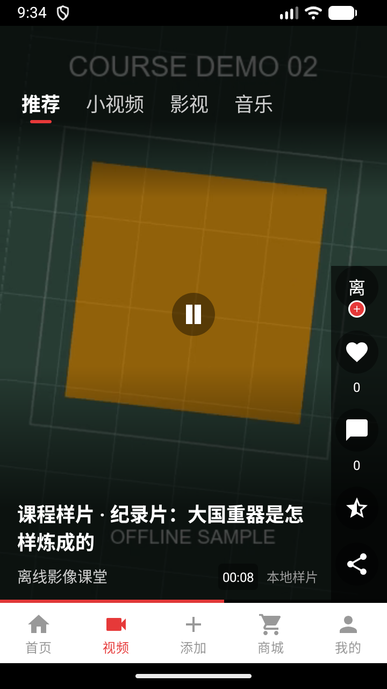 |  | 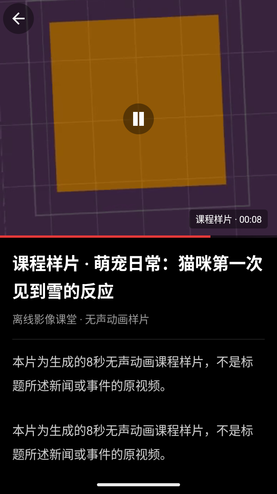 | 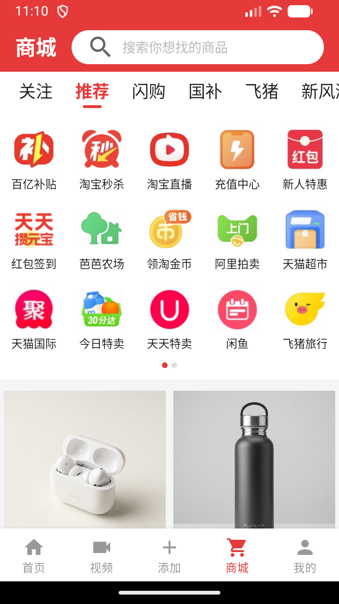 |

| 沉浸式发布弹窗 | 全功能创作中心 | 我的作品与内容库 | 购物车管理 |
|---|---|---|---|
| 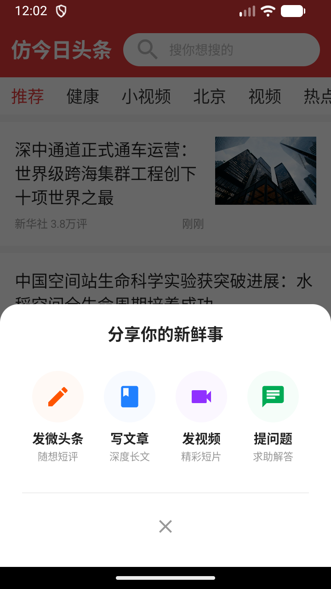 | 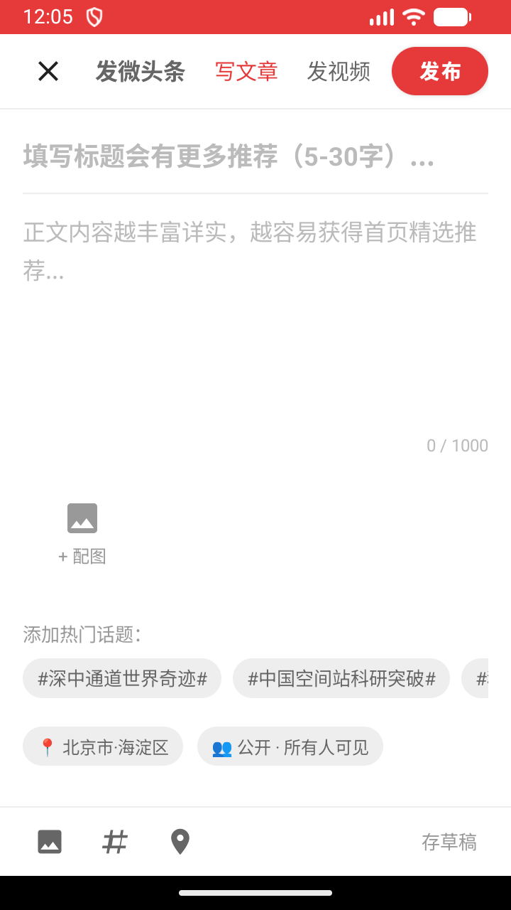 | 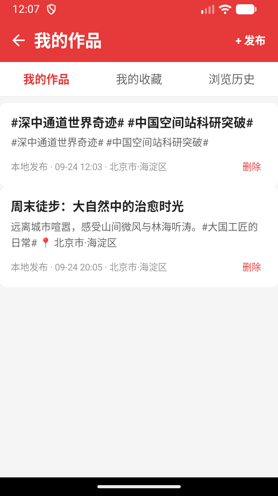 | 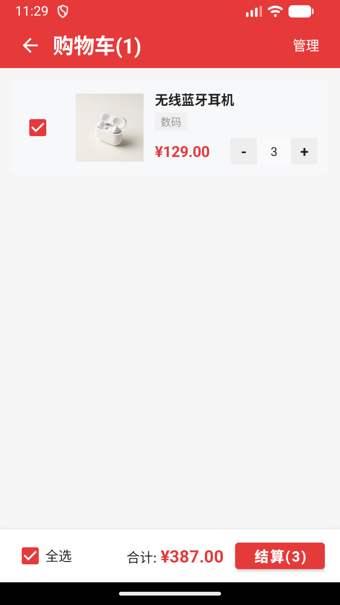 |

| 结算与确认订单 | 订单详情与物流 | 订单中心管理 | 个人中心 |
|---|---|---|---|
| 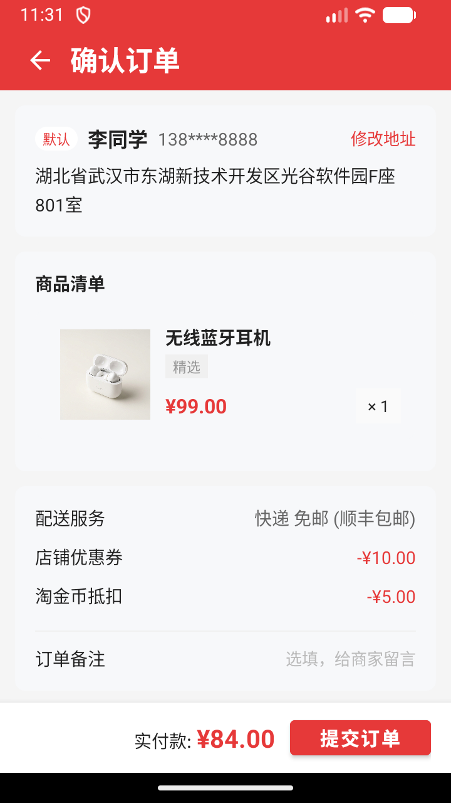 | 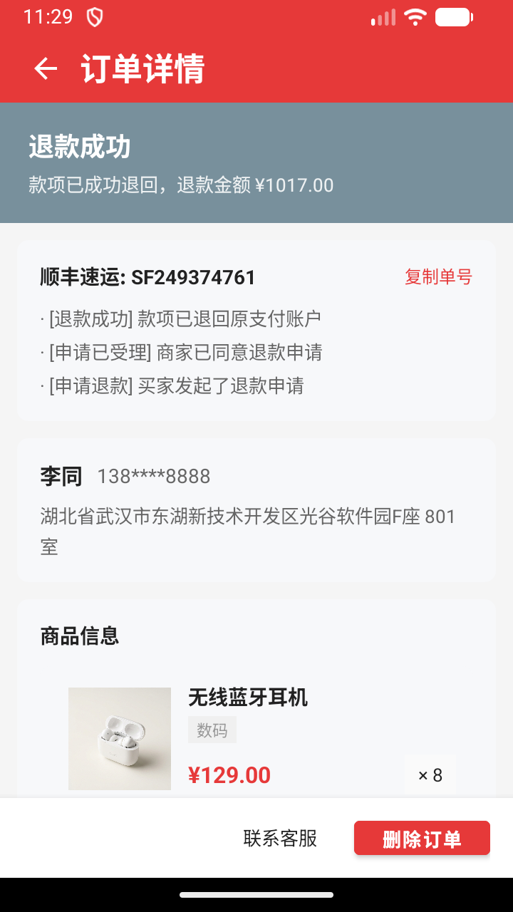 | 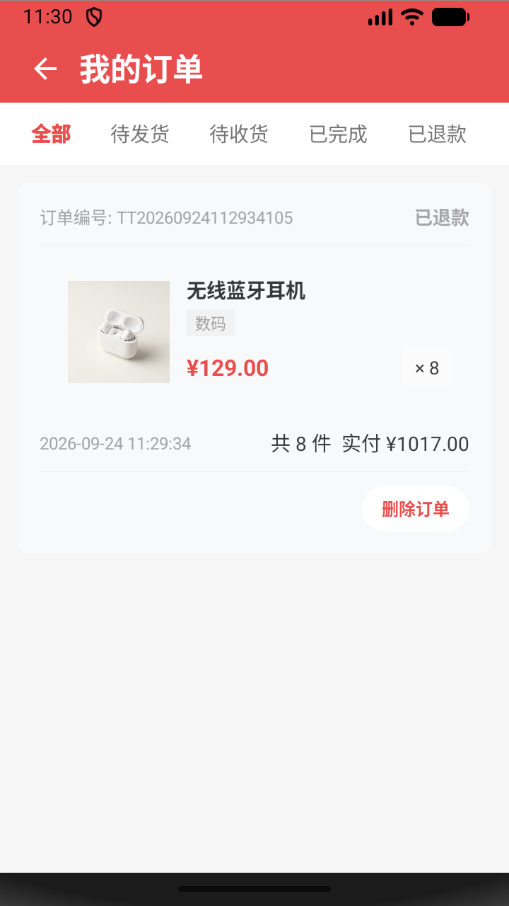 |  |

| 设置 | 编辑资料 | 消息列表 | 聊天详情 |
|---|---|---|---|
|  |  | 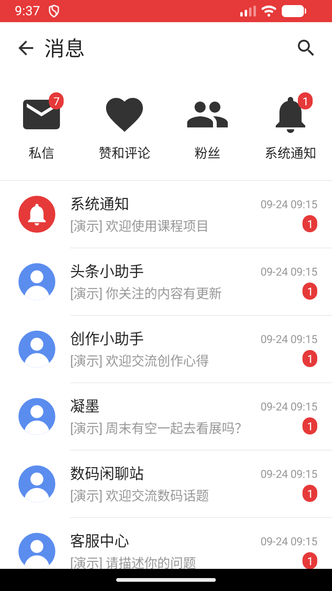 | 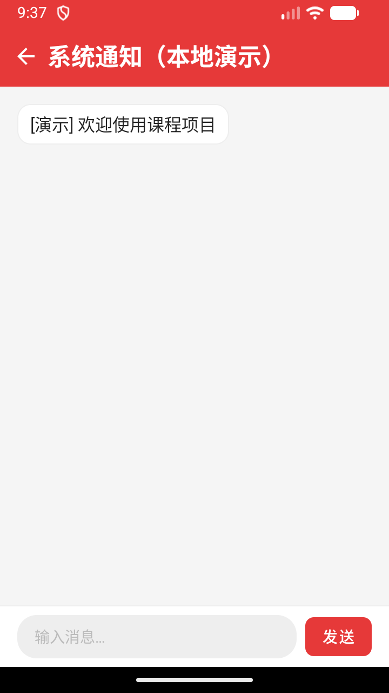 |

---

## 功能与架构

### 架构改造：统一 Fragment 容器与局部更新

为满足课程设计关于「主界面用 Fragment 实现界面局部更新」的核心要求，项目重构为：
- **`MainActivity`**：作为顶层单一宿主容器，统一调度底部导航栏（`BottomNavigationView`），管理主页面回退栈（`history`）。
- **`HomeFragment` / `VideoFragment` / `ShopFragment` / `MineFragment`**：分别承载首页、视频、商城、我的四大核心页面，继承通用基类 `PageFragment`。
- **页面切换策略**：采用 `FragmentManager` 的 `show()` / `hide()` 结合 `setMaxLifecycle(RESUMED / STARTED)` 事务调度，只更新内容区域、不销毁重建模版，完美保留各页面滚动位置、频道状态与播放进度，避免反复切页白屏与闪烁。
- **平滑兼容**：保留 `HomeActivity`、`VideoActivity`、`ShopActivity`、`MineActivity` 等传统入口，均继承自 `MainActivity`，老 Intent 跳转无缝衔接。

### 登录

- **一键登录**：协议勾选 + 一键登录按钮 + 手机号 / Apple / 更多三个第三方入口，支持本地登录状态记录（`session.xml`）
- **密码登录**：`+86` 区号选择、账号密码输入、找回密码、跳转手机号登录
- 两页之间可互相跳转，协议未勾选时给出友好的 Toast 提示

### 首页

- 顶部品牌红搜索栏，实时监听输入与软键盘搜索按键，支持标题/内容关键词精准过滤与空结果提示（`tv_search_empty`）
- 7 个频道标签：推荐 / 健康 / 小视频 / 北京 / 视频 / 热点 / 娱乐
- **海量高品质新闻内容（全站 58+ 篇真实新闻，推荐流扩充至 28 篇优质深度报道）**：
  - 覆盖深空探索（空间站生命舱科研、中国天眼FAST脉冲星发现）、大国重器（深中通道、复兴号高寒动车组、全海深奋斗者号）、绿色低碳（300兆瓦压缩空气储能、沙漠风光大基地、白鹤滩水电站）、前沿科技（车规级主控芯片、超算量子模拟算法、AI古籍修复）、传统文化（三星堆AI三维复原、敦煌数字藏经洞）及民生福祉（跨省异地医保直接结算、数字校园、反算法杀熟、乡村普惠金融）等多元重大主题
  - 每条新闻均配备新华社、人民日报、央视新闻、科技日报等权威主流媒体来源、逼真互动评论量及时间戳，正文配备 3~4 段专业严谨、文风优雅的深度通讯报道
  - 丰富的高清真实摄影配图资源（`news_smart_city`、`news_space_rocket`、`news_tech_chip`、`news_train_speed`、`news_green_energy` 等 14 组专业图片）
- 完整支持 **4 种 item 布局与交互体验**：
  - 纯文字（快讯/深度政策解读）
  - 单图（左文右图卡片）
  - 三图（文下三张高清图并排展示）
  - 视频（高清封面 + 居中半透明播放图标 + 点击直通全屏沉浸播放页）
- **新闻图文详情页（`NewsDetailActivity`）**：
  - 点击列表任意新闻无缝转场进入图文详情页，展示完整报道标题、来源时间元数据、大图及长篇格式化段落正文
  - 内置本地阅读历史自动记录、一键「收藏文章 / 取消收藏」及系统原生「分享文章」功能
- **热点**频道：`ListView` + `ArrayAdapter` 渲染的大国工匠列表，点击条目弹出人物生动事迹详情弹窗
- 底部 5 项导航：首页 / 视频 / 添加（创作发布） / 商城 / 我的

### 创作发布与内容库（Add 模块深度优化）

- **沉浸式发布弹窗（`PublishDialog`）**：
  - 点击底部导航中心高亮「＋」按钮或个人中心「+ 发布」，自底向上平滑唤出今日头条风格的沉浸式选择弹窗（`dialog_publish_chooser.xml`）。
  - 提供 4 大精美创作入口：
    - 📝 **发微头条**（随想短评、图文互动、热门话题）
    - 📰 **写文章**（深度长文、多段落论述、正式标题）
    - 🎬 **发小视频**（精彩短片、生活分享、视频说明）
    - 💬 **提问题**（求助解答、社区互动、多角度讨论）
- **独立全功能创作中心（`PublishActivity`）**：
  - 动态多形态 Tab 切换（发微头条 / 写文章 / 发小视频 / 发起问答），智能适配标题栏显隐与字数计数器（`0 / 1000`）。
  - **精美配图选择器与缩略图管理**：内置图库 GridView 弹窗（覆盖科技、城市、交通、自然等多张精选大图），支持添加最多 3 张配图；编辑界面支持水平滚动缩略图预览，并可一键右上角叉号移除。
  - **热门话题快速插入**：横向话题气泡栏（`#深中通道世界奇迹#`、`#中国空间站科研突破#`、`#科技数码前沿#`、`#大国工匠的日常#` 等），点击即可自动在当前光标位置无缝注入 `#话题#` 标签。
  - **位置与可见权限切换**：点击快速轮换属地定位（`📍 北京市·海淀区`、`📍 深圳市·南山区` 等）与权限设置（`👥 公开 · 所有人可见`、`🔒 仅自己可见` 等）。
  - **草稿箱与提交校验**：支持未完成内容一键「存草稿」；正文内容为空时提交按钮自动置灰半透明并拦截提示。
  - **双向数据实时同步**：用户点击「发布」后，创作内容不仅即时持久化存入本地 `ContentStore`（我的作品），同时无缝插入至 `HomeFragment` 首页推荐信息流的最顶部（`HomeFragment.addUserPost(...)`），实现发帖即时可见的沉浸闭环体验！
- **现代化内容与作品中心（`ContentLibraryActivity`）**：
  - 顶部三大 Tab 分类滑动切换：「我的作品」、「我的收藏」、「浏览历史」。
  - 卡片式内容流展示，呈现作品标题、摘要正文、发布时间及属地信息。
  - 支持单篇作品本地删除（二次确认防误触）与空状态友好占位提示，右上角配备直达「+ 发布」快捷键。

### 商城与完整电商闭环

- **顶部频道标签**（关注 / 推荐 / 闪购 / 国补 / 飞猪 / 新风潮 / 穿搭）：`HorizontalScrollView` 承载，选中的带红色圆角下划线，实时过滤对应品类商品
- **宫格入口**（两页，左右翻页 + 圆点指示）：横向 `RecyclerView` + `PagerSnapHelper` 实现淘宝式整页翻页，一页就是一个 5 列 `GridLayout`；25 个图标裁剪自高清矢量素材
- **两列瀑布流与 30 件精选商品**：`RecyclerView` + `StaggeredGridLayoutManager(2, VERTICAL)`，涵盖数码、家居、食品、服饰、美妆、百货六大类别，30 张电商棚拍实物商品图均采用高保真自适应展示
- **独立购物车模块（`CartActivity`）**：
  - 顶栏支持一键切换「管理」模式与商品多选
  - 实时勾选计算：联动全选 CheckBox 与动态金额汇总
  - 数量加减步进器（+/-）：支持最小为 1，减至 0 自动弹出二次确认移除
  - 批量删除商品与空购物车友好占位提示
- **结算与确认订单页（`OrderConfirmActivity`）**：
  - 真实收件地址卡片（支持就地弹窗修改姓名、电话与收货地址）
  - 商品明细清单、配送服务（顺丰包邮）、优惠券抵扣（-¥10.00）与淘金币抵扣（-¥5.00）明细
  - 订单备注填写与真实应付总额核算，点击「提交订单」自动扣除购物车结算商品并生成新订单
- **订单列表中心（`OrderListActivity`）**：
  - 顶部五大状态 Tab 切换（全部 / 待发货 / 待收货 / 已完成 / 已退款）
  - 订单卡片动态操作：待发货支持「提醒发货」与「申请退款」；待收货支持「查看物流」与「确认收货」；已完成支持「再次购买」（自动重加购物车）与「删除订单」
- **订单详情页（`OrderDetailActivity`）**：
  - 顶部状态横幅动态着色（橙/蓝/绿/灰）
  - 模拟真实顺丰速运物流轨迹流转与运单号一键复制剪贴板
  - 完整的订单金额明细、下单时间、支付方式与「联系客服」（无缝跳转客服聊天室）
- **本地持久化与数据模型（`ShopStore`）**：购物车商品与订单生命周期全流程本地 SharedPreferences 离线持久化存储，重进应用状态不丢
- 顶栏搜索框支持按商品标题与分类即时模糊搜索，顶栏右侧新增快捷购物车悬浮入口图标

### 视频

- **多频道承载**：`ViewPager2` 横向联动 4 个频道（推荐 / 小视频 / 影视 / 音乐），支持滑动过程联动 Chrome 顶栏透明度渐变（`OnPageChangeCallback`）
- **推荐频道（抖音式全屏流）**：
  - 竖向 `LinearLayoutManager` + `PagerSnapHelper` 实现一屏一条吸附翻页
  - 集成项目本地离线课程短片（`OfflinePlayer` + `raw/course_motion_*.mp4`），离开界面或切页即时暂停并释放，兼顾节能与流畅
  - 完整右侧操作栏：作者头像、关注、点赞、评论数、收藏、分享
  - 手势支持：单击切换播放/暂停（`onSingleTapConfirmed`），双击点赞冒红心动画（`onDoubleTap` + `ViewPropertyAnimator`）
  - 本地点赞持久化：点赞状态通过 `VideoStore` 存入 SharedPreferences，退出重进状态不丢
- **双列等高网格频道**（小视频 / 影视 / 音乐）：`RecyclerView` + `GridLayoutManager(2)`，封面严格按 16:9 计算，点击直接进入独立全屏播放详情页
- **播放详情页**（`VideoDetailActivity`）：竖屏沉浸式全屏播放页，状态栏黑底透入，底部集成紧凑型相关推荐列表
- **视频搜索**：顶栏搜索支持在全频道视频标题中快速匹配

### 我的

- 头像、昵称、个人简介、IP 属地标签
- 关注 / 粉丝 / 获赞动态计数
- 快捷操作区：支持直接跳转发布、好友、消息私信、应用设置
- **九宫格功能入口**：消息私信、浏览历史、创作中心、阅读记录、购物车、收藏、客服中心、本地订单，点击进入真实本地内容库或操作弹窗
- 作品区：收藏 / 赞过子标签 + 全部 / 视频 / 微头条筛选胶囊
- **资料持久化**：头像、昵称、简介等修改统一写入 `ProfileStore`，返回后首页与个人中心实时更新

### 消息与聊天

- **会话列表**：8 个预置对话，每行展示圆底头像 + 会话名 + 预览消息 + 时间 + 未读角标，点击进入会话后即时标记已读（未读清零）
- **本地持久化聊天室**（`ChatActivity`）：
  - 左右两种气泡布局（自己发送与对方回复）
  - 支持发送文本消息并写入 `ChatStore`（按会话隔离持久化），退出进程后历史消息完整保留
  - 模拟真实互动回复：发送后延迟 1 秒由本地定时器自动触发对方回应

### 设置与编辑资料

- **设置页**（`SettingsActivity`）：26 个细分设置项，覆盖账号安全、隐私、深色模式、大字模式等，底部提供安全退出登录入口
- **编辑资料**（`EditProfileActivity`）：包含资料完整度动态计算，实时保存用户名、简介、性别、生日、所在地等字段到本地存储

---

## 环境与依赖

| 项 | 版本 |
|---|---|
| Android Gradle Plugin | 7.3.1 |
| Gradle | 7.4 |
| compileSdk / targetSdk | 32 |
| minSdk | 29 |
| Java 版本 | 源码兼容 8（运行 Gradle 需 JDK 11 及以上） |
| 开发工具 | Android Studio Dolphin (2021.3.1) |

依赖只有两个（无网络库、无图片加载库；`RecyclerView` 由 material 传递引入）：

```gradle
implementation 'androidx.appcompat:appcompat:1.4.1'
implementation 'com.google.android.material:material:1.5.0'
```

---

## 如何运行

1. 用 Android Studio 打开项目根目录，等待 Gradle Sync 完成
2. 直接运行 `app` 模块，或命令行构建：

```bash
./gradlew assembleDebug
```

> **注意**：`local.properties` 记录的是本机 SDK 路径，已被 `.gitignore` 排除，不会上传。克隆后 Android Studio 会在首次打开时自动生成，无需手动处理。

---

## 项目结构

```
app/src/
├── androidTest/java/com/example/toutiao/demo/
│   ├── ExampleInstrumentedTest.java         应用基础上下文测试
│   ├── MainNavigationTest.java              四主页面 Fragment 切换、回退栈与状态恢复测试
│   ├── HomeNewsContentTest.java             首页深度报道数量与多段落内容质量测试
│   ├── OfflineVideoTest.java                离线短视频解码、互动状态与播放器生命周期测试
│   ├── ProfileChatPersistenceTest.java      个人资料与聊天持久化回归测试
│   ├── ShopCartOrderTest.java               购物车生命周期、金额核算与订单持久化测试
│   └── PublishFlowTest.java                 创作发布、首页动态插入与内容库管理测试
│
└── main/
    ├── java/com/example/toutiao/demo/
    │   ├── MainActivity.java                顶层宿主，单 Activity + 4 Fragment 导航调度
    │   ├── PageFragment.java                主页面 Fragment 基类
    │   ├── HomeFragment.java                首页 Fragment（信息流 + 搜索过滤 + 工匠列表 + 发帖同步）
    │   ├── VideoFragment.java               视频 Fragment（ViewPager2 多频道 + 抖音式全屏流）
    │   ├── ShopFragment.java                商城 Fragment（横向两页宫格 + 两列瀑布流）
    │   ├── MineFragment.java                我的 Fragment（个人信息 + 九宫格 + 资料联动）
    │   ├── HomeActivity.java                兼容入口（继承自 MainActivity）
    │   ├── VideoActivity.java               兼容入口（继承自 MainActivity）
    │   ├── ShopActivity.java                兼容入口（继承自 MainActivity）
    │   ├── MineActivity.java                兼容入口（继承自 MainActivity）
    │   ├── LoginOneKeyActivity.java         启动页，一键登录与本地登录态
    │   ├── LoginPwdActivity.java            密码登录
    │   ├── NewsDetailActivity.java          新闻图文详情
    │   ├── VideoDetailActivity.java         全屏沉浸播放页（离线短片播放 + 相关推荐）
    │   ├── CartActivity.java                独立购物车页面（数量加减、多选、批量管理）
    │   ├── OrderConfirmActivity.java        订单确认与结算页（地址编辑、抵扣明细）
    │   ├── OrderListActivity.java           订单管理中心（五态 Tab、发货提醒、退款、再次购买）
    │   ├── OrderDetailActivity.java         订单详情页（物流轨迹跟踪、单号复制、联系客服）
    │   ├── PublishDialog.java               底部沉浸式发布弹窗选择器（四大创作形态）
    │   ├── PublishActivity.java             独立全功能创作中心（多模式、配图预览、话题、定位）
    │   ├── ContentLibraryActivity.java      现代化内容中心（我的作品、我的收藏、浏览历史）
    │   ├── MsgActivity.java                 消息会话列表（未读状态与已读同步）
    │   ├── ChatActivity.java                本地聊天室（支持会话隔离持久化与自动应答）
    │   ├── SettingsActivity.java            系统与偏好设置
    │   ├── EditProfileActivity.java         编辑资料（持久化存储与完整度计算）
    │   ├── OfflinePlayer.java               本地离线短视频播放控制器
    │   ├── ProfileStore.java                用户资料 SharedPreferences 持久化封装
    │   ├── ChatStore.java                   聊天记录持久化封装
    │   ├── VideoStore.java                  视频点赞/收藏状态持久化封装
    │   ├── ContentStore.java                作品、收藏与浏览历史本地持久化存储
    │   ├── ShopStore.java                   购物车与订单全流程持久化引擎
    │   ├── ShoppingDialogs.java             购物车与订单本地交互弹窗
    │   ├── VideoChannelAdapter.java         视频 ViewPager2 频道适配器
    │   ├── VideoFeedAdapter.java            推荐流全屏吸附适配器（手势与点赞动画）
    │   ├── VideoAdapter.java                双列视频网格适配器
    │   ├── NewsMultiAdapter.java            4 种布局新闻 RecyclerView 适配器
    │   ├── ShopAdapter.java                 瀑布流商品适配器
    │   ├── MsgAdapter.java                  消息会话适配器
    │   └── ChatAdapter.java                 聊天气泡适配器
    │
    └── res/
        ├── layout/          44 个布局文件（含 activity_main, fragment_*, activity_publish 等）
        ├── raw/             3 个项目内置离线课程短片 (course_motion_1~3.mp4)
        ├── drawable/        65 个矢量图标与图形 Shape 资源
        ├── drawable-nodpi/  87 个高清位图（精选商品图、宫格图标、摄影大图）
        ├── values/          colors(35 tokens) / dimens(20) / styles(27) / themes / strings
        ├── values-night/    深色模式防御性主题定义
        ├── color/           按钮与底部导航动态着色选择器
        └── menu/            底部导航菜单 (bottom_menu.xml)
```

---

## UI 设计说明

页面样式没有散落在各个布局里硬编码，而是收敛成了一套可复用的资源体系：

### 设计变量

- **`colors.xml`** —— 语义化色板，共 35 个 token。品牌红 `#E63939`、三级文字色、三级背景色、图标色、分隔线色，替代原先散落在各布局里的硬编码色值。其中 6 个（`bg_player` / `text_on_dark` / `text_on_dark_secondary` / `divider_on_dark` / `press_on_dark` / `progress_track`）是视频播放页专用的深色 token
- **`dimens.xml`** —— 字号收成 6 档（`text_display` / `text_headline` / `text_title` / `text_body` / `text_body_small` / `text_caption`），间距按 4dp 栅格收成 7 档
- **`styles.xml`** —— 27 个 style，把三处高频重复抽成模板：
  - 设置项行（设置页 26 行 + 编辑资料页 9 行）
  - 分隔线（全项目曾手写 80 处）
  - 底部导航（首页 / 商城 / 我的 / 视频 4 个页面共用；改造前是逐字重复的 11 行）

### 主题

`Theme.Toutiao` 基于 `Theme.MaterialComponents.Light.NoActionBar`，配好 `colorPrimary` / `colorSecondary` / `statusBarColor` / 文字默认色，并通过 `AndroidManifest.xml` 真正挂到应用上。

### 深色模式的防御

这套布局是**强制浅色**的（硬编码浅色底 + 深色字），所以对系统深色模式做了三重防御，保证深色设备上表现与浅色完全一致：

1. 主题 parent 用 `Light` 而非 `DayNight`，不激活系统的深色资源切换
2. `android:forceDarkAllowed="false"` 挡掉 Android 10 的强制反色
3. `values-night/themes.xml` 写入与 `values/` 逐项一致的定义，避免主题属性在深色设备上缺失

登录、首页、新闻详情、我的、设置、编辑资料几个页面已在模拟器上开启系统深色模式逐页验证，与浅色模式表现一致。后加的商城 / 消息 / 聊天 / 视频页沿用同一套颜色 token、没有引入硬编码色值，理论上表现相同，但**尚未逐页重新验证**。

视频列表页与播放页已单独复验过：列表页在深色模式下与浅色模式**逐像素一致**（截图对比）；播放页本来就是**故意**的黑底（沉浸播放器就该是黑的），深色模式下同样保持黑底白字，没有被反色——上面第 2 条 `forceDarkAllowed=false` 挡着，验证时也确认了这一点。

### 视频封面比例的一个取舍

项目里的图**没有一张是横构图**——`image*` 是分辨率最高的一组，却全是竖图或近方图（最方的 `image7` 是 939×925）。`centerCrop` 之后保留的原图高度 = 源图宽高比 ÷ 框的宽高比，所以**框越方/越竖，裁得越少**。这条规律决定了两个页面用了两种比例：

**列表页网格卡片：16:9。** 每条视频的封面框严格 16:9，用 `0dp × 0dp` + `app:layout_constraintDimensionRatio="H,16:9"` 让高度由实际宽度算出。**这里刻意不写死高度**：一格的宽度是 `GridLayoutManager` 平分出来的、随屏幕宽度变（360dp 屏上 160dp、411dp 屏上 185dp），写死 90dp 就只在 360dp 屏上等于 16:9，换台机器就不是了——这个坑改造时真的踩到过一次，模拟器 411dp 宽下量出来是 2.06:1。

**播放页：故意不是 16:9。** 播放区用 `0dp + weight=1` 占上半屏，封面 `centerCrop` 把这块整铺满，比例由屏幕形状决定。这不是漏改：这一页的画面是**竖构图的照片而不是真视频**，没有「必须保持的原始画幅」，留黑边等于为不存在的问题付代价。

半屏框的宽高比 = 屏宽 ÷ 半屏高（本机 411.43 ÷ 353.52 ≈ **1.16**），比 16:9 的 1.778 更接近方图，所以裁切明显变轻：

| 素材 | 尺寸 | 16:9 框（列表页） | 半屏框 1.16（播放页） |
|---|---|---|---|
| `image7` | 939×925 | 57% | **87%** |
| `img4` | 784×944 | 47% | **71%** |
| `image2` | 1080×1447 | 42% | **64%** |
| `image5` | 960×1280 | 42% | **64%** |
| `image8` | 960×1358 | 40% | **61%** |
| `image6` | 1080×1621 | 37% | **57%** |
| `image1` / `image4` | 640×1386 / 1000×2166 | 26% | 40% |

（半屏框的比例随屏幕形状变，但手机上半屏普遍落在 1.1~1.2 这一带，所以这组数字有代表性。列表页那一列是固定的 16:9。）

所以视频页只挑裁得动的 `image7 / image2 / image5 / image8 / img4 / image6` 这几张用，并刻意避开只剩一条横带的 `image1` / `image4`。另外视频标题都写成「纪录片 / 影像 / 现场」这类与具体画面无关的措辞，避免裁切后出现图文错位。

列表页一格 160dp 宽、封面 90dp 高（`160 ÷ 16 × 9`），这个高度是比例算出来的、不写在布局里；想换成 4:3 只改 `item_video.xml` 里的 `layout_constraintDimensionRatio` 一处。

**左右留白为什么拆成两段**：`GridLayoutManager` 只平分「父容器**去掉 padding 之后**」的宽度，所以 16dp 的页面留白必须拆成 `rv_video` 的 `paddingHorizontal=12dp` 加卡片自己的 `layout_marginHorizontal=4dp`，相加才等于 `page_padding`。两列之间的 8dp 由两个 4dp 的外边距合成。改成一边写 16dp 会让第一列和顶栏标题错位。

### 顺带修掉的问题

- 首页 tab 选中色 / 未选中色原来在 Java 里硬编码 `0xFFE63939` / `0xFF333333`，与色板 token 脱节，已改为引用 `colors.xml`（`selectTab()` / `resetTabColor()`），6 个新闻标签的点击监听也收敛成 `bindNewsTab()` 一处

- 设置页「图文详情滑动方式」标题与右侧值**重叠**——原因是行高写死 64dp，而该行内容实测约 368dp，超出 360dp 的屏幕宽度。改为 `wrap_content` + `minHeight`，左侧文字列用 `0dp` + `weight=1` 主动占满剩余宽度
- 登录页按钮上的 `android:radius="12dp"` **从未生效**——该属性只对 `<shape>` 根节点有效，写在 `<Button>` 上会被忽略
- 我的页「0关注 1粉丝 1获赞」原是一个 TextView 用空格硬拼，数字变四位数就会折行，已拆成三个独立 TextView
- 详情页正文用次级灰 `#333333`，与标题层级倒挂，已改为主文字色
- 视频封面的播放键原用系统 `@android:drawable/ic_media_play`（纯黑三角），在浅色封面上几乎不可见，已重绘为半透明黑圆 + 白色三角
- 启动图标原是 Android Studio 默认的绿色机器人，已重绘为品牌红 + 白色资讯卡片
- **商城页底部导航整条是空的**——`activity_shop.xml` 里的 `BottomNavigationView` 漏了 `style="@style/Widget.Toutiao.BottomNav"`，而五个菜单项恰恰是挂在这个 style 的 `app:menu` 上的。连带后果比"没有图标"严重得多：`setSelectedItemId()` / `setOnItemSelectedListener()` 全部静默失效，商城页变成一个点不动的死胡同。同时补上了 `fitsSystemWindows` 和底部约束——原来用 `tools:ignore="MissingConstraints"` 把 lint 警告压掉了，而那个警告是对的，视图实际被扔在了左上角
- **我的页跳商城漏了 flag**——全项目就这一处没加 `CLEAR_TOP | SINGLE_TOP`，反复「我的 → 商城 → 返回」会一直堆新实例
- **商城三个频道指向同一种商品**——「飞猪 / 新风潮 / 穿搭」原本共用一条 `return`，全指向只有 1 个商品的「服饰」。而 `filterByTab()` 的兜底只在结果**为空**时才触发，1 个不算空，兜底救不了，点进去就是个孤零零的双肩包

改造成双列 + 沉浸播放页时又发现三处「浅色页面里本来是对的、一搬到黑底上就失效」的问题：

- 播放页「相关视频」整行的按压反馈**在黑底上完全看不见**——它原来用 `?attr/selectableItemBackground`，波纹色取自 Light 主题的 `colorControlHighlight`（12% 黑），压在黑底上等于零对比度，点上去像没反应。已换成自带白波纹的 `bg_ripple_on_dark`（`press_on_dark`，12% 白）
- 分隔线和小节标题**不能照搬浅色页面的 token**：`divider` 的 `#EEEEEE` 在黑底上是一条刺眼的白线，`SectionTitle` 的 `#222222` 更是直接看不见。加了 `Widget.Toutiao.Divider.OnDark` / `Widget.Toutiao.SectionTitle.OnDark` 两个变体（靠点号隐式继承，只写差异项）。用变体而不是在元素上写 `android:background` 覆盖，是因为 `styles.xml` 头部第 1 条就禁止元素级覆盖 style——那样会静默盖掉整个样式
- 模拟进度条的轨道**原来选错了参照系**。最初定的是 20% 白（`#33FFFFFF`），理由是"12% 白在 3dp 细线上看不出进度条总长"——那是**按轨道压在黑底上**想的。可轨道其实压在**封面**上（进度条贴播放区下沿，而播放区整块被封面铺满），实测第一条视频（`image2`，红色日历）播到 50% 时，左半截红色填充条和右半截"20% 白 + 红封面"糊成一片红，整条进度条看不见。已改成 60% 黑的遮罩 `#99000000`：亮封面上压出一段深灰、暗封面上几乎融进黑，两种情况下红色填充条都还是红的

### 一个 Material 主题的坑

切换到 Material 主题后，布局里的 `<Button>` 会被 `viewInflaterClass` 自动替换成 `MaterialButton`，而 **`MaterialButton` 会直接丢弃 `android:background`**，改用自带的 `MaterialShapeDrawable` + `backgroundTint`（默认 `?attr/colorPrimary`）填底。

后果是自定义背景 drawable 完全不生效——筛选胶囊的灰底、浅红底全被主色覆盖，红底红字导致文字不可见。给 `backgroundTint` 设 `@null` 也没用，因为背景整个被替换掉了。

最终处理：

- **筛选胶囊**改用 `<TextView>`，绕开 `MaterialButton` 的这套逻辑
- **主按钮**改用 `MaterialButton` 自己的属性表达：`backgroundTint` 指向一个 ColorStateList（`res/color/button_primary_tint.xml`）承载常态 / 按压 / 禁用三态，`cornerRadius` 负责圆角

### 沉浸式为什么没在 API 29 上崩

播放页整页沉浸（隐藏状态栏、内容铺满全屏、边缘下滑临时唤出）。这套 API 在 `minSdk 29` 上有个不算明显的分界：

- 平台自带的 **`WindowInsetsController` 是 API 30 才有的**，直接用会崩。所以全程走 `androidx.core` 的 `WindowInsetsControllerCompat`。它在 API 29 上的落地其实是**老的 `systemUiVisibility`**（构造器按 `Impl30 → Impl26 → Impl23 → Impl20` 分派）：`hide(statusBars)` 变成 `SYSTEM_UI_FLAG_FULLSCREEN`，`BEHAVIOR_SHOW_TRANSIENT_BARS_BY_SWIPE` 变成 `IMMERSIVE_STICKY`。所以这一段**不需要任何 `Build.VERSION` 判断**
- `setDecorFitsSystemWindows(false)` 在 API 29 上给 decorView 加的是 `LAYOUT_STABLE | LAYOUT_HIDE_NAVIGATION | LAYOUT_FULLSCREEN`——**导航栏那条 flag 也在里面**。只补顶部内边距的话，滚到最底下时最后一条「相关视频」会被导航栏压住且滚不出来，所以 `systemBars()` 要整组取
- 状态栏隐藏后 `statusBars` 的 top 归零，有刘海 / 挖孔的机器上真正会挡住返回键的是**挖孔本身**，所以取值要写成 `systemBars() | displayCutout()`。用模拟器的「模拟刘海屏」实测过：不带上 `displayCutout` 时返回键会顶进挖孔区
- **`getRootWindowInsets()` 在 `onCreate` 里返回 `null`**（那一刻视图还没 attach、第一次 traversal 也还没发生），所以"先读一次 inset 再 hide"这条捷径不成立，只能用 `ViewCompat.setOnApplyWindowInsetsListener` 监听
- 监听器里必须用**绝对值** `setPadding(...)`，**不能写 `+=`**：系统栏状态变化时这个回调会反复触发，累加的话内边距会一次比一次大。这也是实测过的——开 / 关刘海模拟时顶部内边距在 48dp 和 0 之间正确切换，没有叠加

另外两个和沉浸式配套、但不属于同一类问题的处理：状态栏底色设成透明（隐藏期间无所谓，但边缘下滑临时唤出时它是**浮在内容上**的，留着主题里的品牌红会在黑页顶部横一条红带）；窗口底色换成黑（主题里是白色 `bg_surface`，刘海让位的缝、转场动画第一帧、临时唤出状态栏时后面那一层，露出来都会是白的）。

### 已知遗留

两处**知道、但这次没做**的地方，写下来免得被当成 bug 查：

- **视频列表每个频道只有 5 条，双列排出来最后一行是单张卡**（2+2+1）。补齐成 2×3 需要每个频道加第 6 条，而现有约定是「频道内封面不重复」、且只有 6 张图可用（见上面的封面比例一节），成本不小，所以维持现状
- **冷启动进入播放页时第一帧可能还有极短的白闪**。`setBackgroundDrawableResource(bg_player)` 已经解决了窗口底色这一层，但如果启动预览窗口（starting window）仍是白的，只能靠在 manifest 上给该 Activity 单独挂一个 theme 解决——代价是新增一个 style，且 `values/` 和 `values-night/` 两个 `themes.xml` 都得写一遍。收益（一帧）与代价不成比例，这次没做

---

## 说明与自动化验证

- 应用内新闻、商品、短片等**全部为项目本地内置数据**，不涉及任何外网请求，不需要申请敏感系统权限，即装即用。
- 用户资料、聊天记录、点赞收藏等状态均持久化存储于应用沙盒私有存储中（`SharedPreferences`），关闭进程重新进入状态不丢失。
- 项目配备完整的端到端与架构回归测试（`app/src/androidTest/`），涵盖主页面 Fragment 切换调度、生命周期联动、离线视频解码播放、资料与聊天持久化、购物车订单闭环、创作发布与内容库全链路，**共 7 大测试套件、14 项自动化测试用例，实测 100% 全部通过**：

```bash
# 执行单元测试
./gradlew testDebugUnitTest

# 在已连接设备/模拟器执行端到端仪器测试
./gradlew connectedAndroidTest
```
