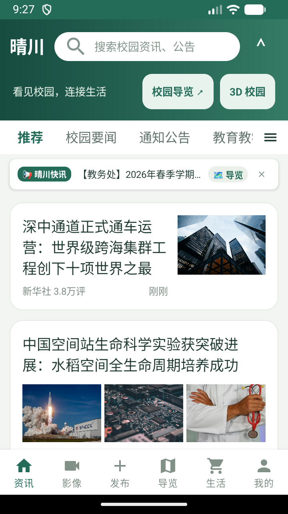
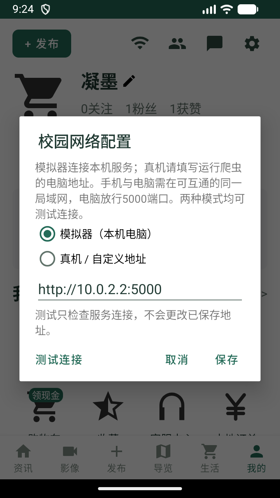
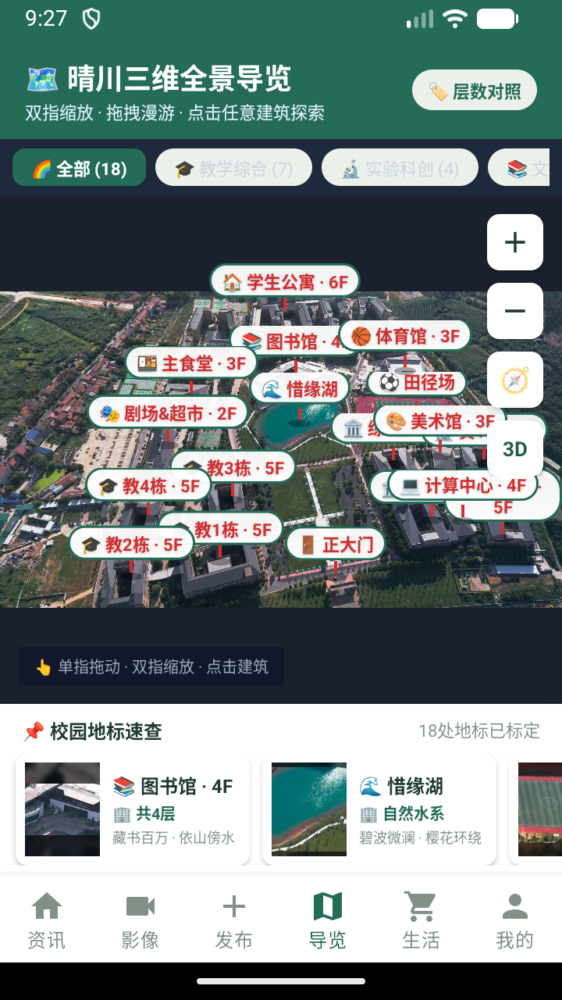
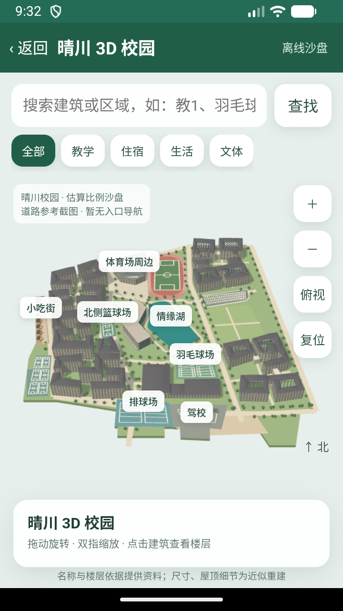
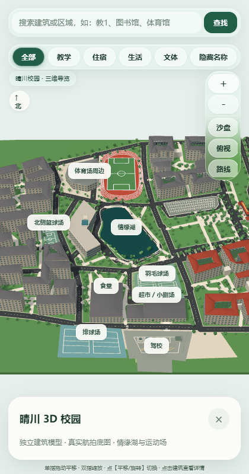
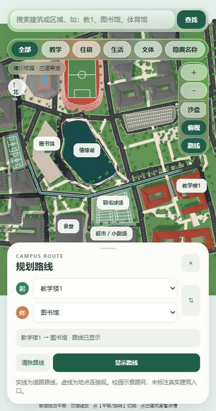
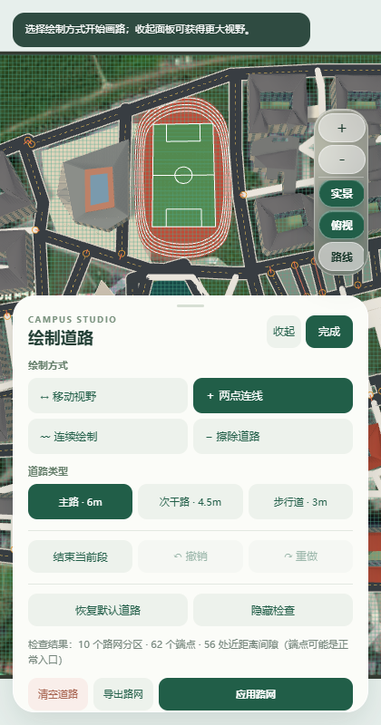
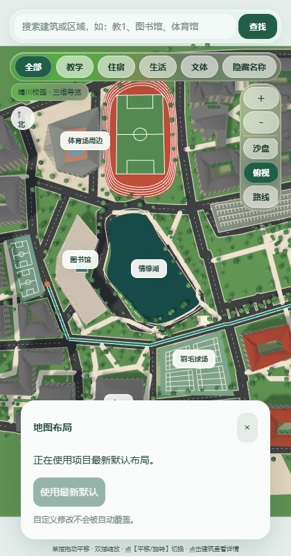

# 晴川 · 校园资讯与三维导览

Java + XML 开发的 Android 校园应用，采用松绿与浅米白界面，整合校园资讯、三维导览、个人内容和生活服务演示。

## 下载安装

[**下载 APK · 2026-10-07 地图体验版 R2**](https://github.com/partjava/android-class/releases/download/campus-preview-2026-10-07-r2/qingchuan-campus-2026-10-07-r2.apk) · [发布说明与 SHA-256 校验文件](https://github.com/partjava/android-class/releases/tag/campus-preview-2026-10-07-r2)

适用于 Android 10 及以上，约 20.6 MB。这是测试签名安装包，包含下文最新地图功能；功能源码已完整推送，R2 Release 源码对应功能提交 `268261c`。已通过 Android 单元测试与构建，尚未进行本轮完整真机验证。覆盖安装通常保留本地数据，签名不同则无法直接覆盖。


主界面提供资讯、影像、发布、导览、生活和我的六个入口。校园资讯可连接本地 Python 服务，三维校园资源随 APK 打包，基础场景可离线浏览。

详细功能、操作范围及演示限制见 [项目功能说明.txt](项目功能说明.txt)，下载、安装及源码构建步骤见 [使用说明.txt](使用说明.txt)。

## 功能概览

| 模块 | 主要功能 |
| --- | --- |
| 校园资讯 | 频道管理、搜索、官网资讯分页、文章详情、收藏与阅读记录 |
| 影像与发布 | 本地视频播放、点赞收藏、发布编辑与个人内容管理 |
| 校园导览 | 实景与三维场景、地点查询、建筑详情与分类筛选 |
| 生活与个人 | 商品、购物车、订单及聊天演示，个人资料与设置 |

登录、购物和部分社交行为属于课程演示流程，具体范围见功能说明。

## 最新界面

以下应用截图拍摄于 2026-10-04，展示当时 APK 的运行界面。

| 首页（展开） | 首页（折叠） |
| --- | --- |
|  |  |

| 我的 | 网络配置 |
| --- | --- |
|  |  |

| 校园导览 | 三维校园 |
| --- | --- |
|  |  |

## 三维校园运行截图 · 2026-10-07

以下 4 张图片由当前工作区的真实网页场景在 420px 浏览器中运行截取，未使用设计稿或合成图片。它们展示最新地图功能，已包含在上方 R2 体验 APK 和仓库 main 源码中。手机 WebView 的实际效果以 APK 运行为准。

| 地图与建筑标注 | 校园路线规划 |
| --- | --- |
|  |  |

| 道路编辑与连通检查 | 默认布局管理 |
| --- | --- |
|  |  |

路线面板支持起终点选择、交换和清除；道路面板支持吸附、复位、撤销重做与连通检查；布局管理可切换项目默认数据，并备份切换前的自定义布局。连通标记用于辅助整理道路，端点不一定是错误。

## 快速开始

### 三维校园：地图操作与路线规划

- 单指默认平移，双指围绕手指中心缩放；松开一根手指后可继续拖动。
- 点“俯视”切换顶视图；俯视状态下旋转保持俯视角度。
- 顶部“隐藏名称 / 显示名称”切换建筑及场地标签。
- 右侧“路线”选择起点、终点并显示路线，支持交换地点与清除路线。实线为沿路网计算的路线，虚线为地点连接段；没有可用道路或道路不连通时显示原因。
- 右侧为毛玻璃工具轨：顶部固定＋、－缩放按钮，下方滑动区同时展示 3 项（首屏为沙盘、俯视、路线，向上滑动展示巡航、平移/旋转、复位、画路和移楼），具备滑动位置记忆缓存；编辑面板可收起，退出编辑恢复原底图；画路与移楼自动互相切换。
- 移楼支持撤销、重做和自动保存；复位恢复用户校准后的默认布局。画路时双指缩放会撤回本次未完成的编辑，避免误画、误擦。

路线使用当前道路和建筑位置，编辑完成后会重新计算已显示的路线。湖泊目的地使用可连接道路的湖岸位置。地图为截图近似重建，未标注真实建筑入口，未提供 GPS、室内导航或真实步行距离。

建筑默认配置在 `app/src/main/assets/campus3d/campus-data.js`，道路默认配置在 `campus-layout.js`。覆盖安装保留设备上的编辑数据；建筑可以在“移楼”中点“全部复位”，当前版本还提供道路复位及整套布局切换入口。

### 道路编辑与布局管理

画路时会优先吸附附近端点和路段，绿色光圈表示已吸附；擦除模式不吸附。道路编辑支持最多 100 步撤销和重做，“恢复默认道路”会恢复项目内的 212 段路网，并可撤销。

“检查连通”会标出端点（橙色圈）、近距离间隙（橙红线）和主路网之外的路段（红线）。端点可能是正常入口，检查结果仅用于辅助整理，不会自动修改路线，也不替代路线规划中的建筑障碍检查。

工具栏中的“默认布局 / 自定义布局 / 默认已更新”可查看当前状态；旧数据没有版本记录时提示与项目默认不同。设备上的修改保留优先加载；切换到最新默认布局前会备份道路和建筑位置，可恢复切换前的布局。

建筑面板和导出使用当前默认布局作为基准：未再调整时偏移为 0，内部保存仍兼容原有数据。最新本地默认包含正大门 −75° 旋转和 212 段道路；路口采用圆顺接头，交汇处中线留白。

### Android 客户端

1. 用 Android Studio 打开项目，配置本机 Android SDK。
2. 同步 Gradle，然后在设备或模拟器上运行 `app`。
3. `local.properties` 使用本机 SDK 路径，不应复制其他电脑的配置。

项目使用 Java 8、compileSdk 32、minSdk 29，适用于 Android 10 及以上。校园三维资源在 APK 内，可离线浏览。

### 校园新闻服务：Windows 一键启动

先安装 Python 3.8+；双击根目录 **启动校园新闻服务.bat**。

终端依次显示五步：寻找可用 Python、检查依赖、安装缺失包、验证导入、启动服务。解释器从本机环境发现，不使用开发者电脑的固定路径。依赖已具备时跳过下载；首次安装需联网，默认使用清华 PyPI 镜像，失败后回退官方源；终端显示源地址、pip 下载输出及失败原因。

窗口保持打开即可提供服务，按 `Ctrl+C` 停止。代码更新后需要重启服务，避免同时启动多个进程占用 5000 端口。

仅检查环境、不安装或启动：

```powershell
powershell -NoProfile -ExecutionPolicy Bypass -File .\start-campus-news.ps1 -CheckOnly
```

其他系统或手动运行：

```shell
python -m pip install flask requests beautifulsoup4 urllib3
python -u campus_news_server.py
```

### 模拟器与真机连接

在“我的”右上角点网络图标（好友图标左侧）：

- 模拟器选择 `http://10.0.2.2:5000`。
- 真机填写爬虫电脑的局域网地址，例如 `http://192.168.1.8:5000`。手机和电脑需处于可互通的局域网，电脑防火墙允许对应端口。
- 两种模式都能点“测试连接”，确认后点“保存”，返回首页刷新。

`/api/health` 验证服务连接与身份；测试成功不等于官网抓取一定成功。跨网络使用需要另行部署可访问的服务。

## 常见问题

- **没有找到 Python**：安装 Python 并添加到 PATH，或确保本机 `py` launcher 可用，再重新双击。
- **依赖下载失败**：检查 pip 输出与网络；可以配置自己的 pip 镜像后重试。安装器使用找到的同一个解释器。
- **端口占用**：关闭重复启动的校园服务，再重新运行。
- **服务可访问但检测接口缺失**：重启更新后的 Python 服务。
- **手机无法连接**：检查电脑 IP、端口、局域网隔离及防火墙；手机不能用模拟器的 `10.0.2.2`。
- **新闻抓取失败**：检查电脑是否能访问学校官网；官网结构或代理环境变化可能影响解析。

## 验证与文件入口

```shell
gradlew.bat testDebugUnitTest assembleDebug
```

安装 Node.js 后，在 PowerShell 中运行地图检查（共 17 个）：

```powershell
Get-ChildItem tests/campus3d/test_*.cjs | ForEach-Object {
    node $_.FullName
    if ($LASTEXITCODE -ne 0) { exit $LASTEXITCODE }
}
```

2026-10-07 更新已验证 320px、420px 和 1100px 浏览器界面，以及双指缩放、松指继续拖动、绘制/擦除防误触、路线交换、湖岸路线和编辑后的路线更新；最新版本还验证了连通检查、道路复位、撤销重做和布局备份恢复。Android 单元测试与 debug APK 构建通过；本次尚未进行真机验证。更新记录见 `docs/superpowers/plans/2026-10-07-map-updates/`。

- Android 源码：`app/src/main/java`、`app/src/main/res`
- 离线三维场景：`app/src/main/assets/campus3d`
- 服务：`campus_news_server.py`
- Windows 启动器：`启动校园新闻服务.bat`、`start-campus-news.ps1`
- 功能清单：[项目功能说明.txt](项目功能说明.txt)

课程演示项目。购物、聊天回复和部分社交数据为本地演示；建筑外观、尺寸和设施依据截图近似重建，未提供入口或室内导航。
